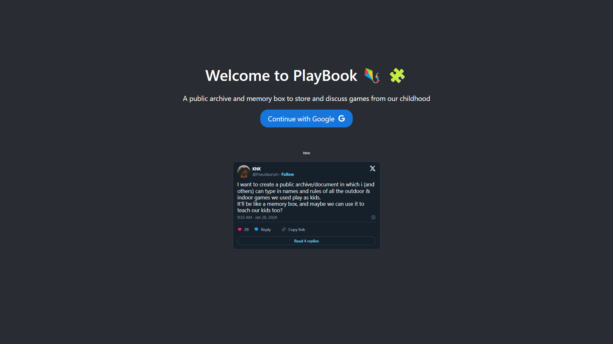
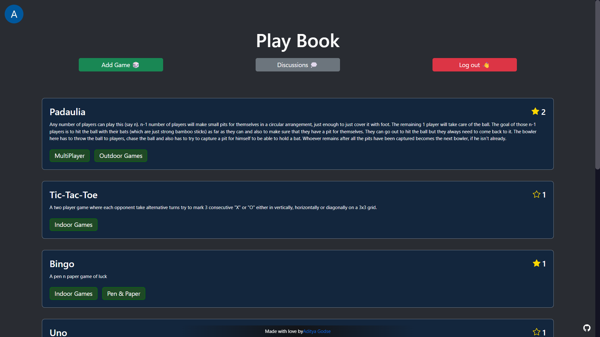
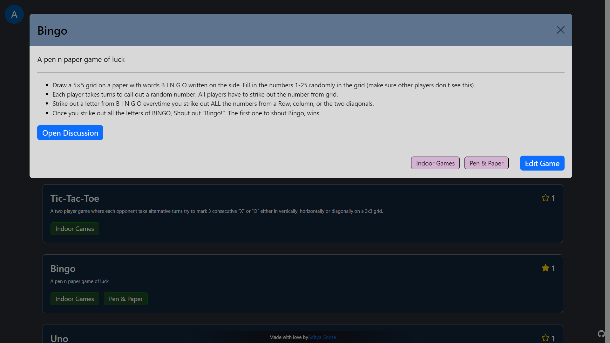
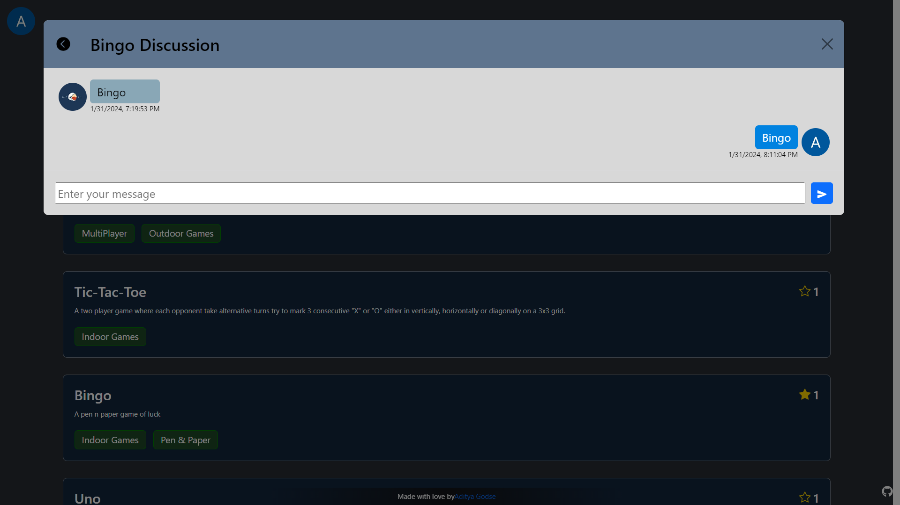

<div style="display: flex; align-items: center;">
    
</div>

# PlayBook : real-time-public-game-archive

PlayBook is a web application built using React, Bootstrap, and Firebase. It serves as a public archive and memory box where users can store and discuss games from their childhood. Firebase is used as BAAS for authentication, real-time database storage, and hosting.

Live application [here](https://playbook-e0207.web.app/)

## Features and use cases

- **User Authentication**: Users can sign in using their Google account.
- **Game Archive**: Store and explore games from childhood, including their names, descriptions, labels, and rules.
- **Discussion Panel**: Engage in discussions with the community through a real-time discussion panel.
- **Discussion Panel for each game**: We have an seperate discussion panel for each game.
- **Star games**: Users can star the games they like as an endorsements.
- **Stickers**: Send stickers in chat messages.

## screenshots








## Run locally

### Firebase Configuration

To configure Firebase, you need to create a firebaseConfig object. This object includes information such as API keys, authentication settings, and database details. Replace the placeholder config in `src/config/firebase.js` with your Firebase configuration.

```javascript
import { initializeApp } from "firebase/app";
import { getAuth, GoogleAuthProvider } from "firebase/auth";
import { getFirestore } from "firebase/firestore";
import { getStorage } from "firebase/storage";

const firebaseConfig = {
  // Your config with firebase API keys
};

const app = initializeApp(firebaseConfig);
export const auth = getAuth(app);
export const googleProvider = new GoogleAuthProvider();

export const db = getFirestore(app);
export const storage = getStorage(app);
```

# Performance

- **`onSnapshot`**: listens for changes in the specified Firestore document or query, and it automatically updates the UI whenever there is a change in the data.
- **`limit`**: When you have a large collection of data, using `limit` allows you to retrieve only a specific number of records. This reduces the amount of data transferred over the network, making your queries more efficient.
- **`read & write rules`**: The Cloud Firestore security rules you provided are written in the Firebase security rules language. This set of rules grants read and write access to any document in the Firestore database only if the request is authenticated (i.e., `request.auth != null`).

### Debouncing

Debouncing is used to ensure that time-consuming tasks do not fire so often, making them more efficient. Useful when dealing with user input.

When a debounced function is called, it sets up a timer. If the function is called again before the timer runs out, the timer is reset. This way, the function will only be executed if there is a pause in the calls. It prevents rapid firing of the function, optimizing performance.

```jsx
import React, { useState, useEffect } from "react";

const debounce = (func, delay) => {
  let timeoutId;
  return function (...args) {
    if (timeoutId) {
      clearTimeout(timeoutId);
    }
    timeoutId = setTimeout(() => {
      func.apply(this, args);
    }, delay);
  };
};

function MyComponent() {
  const [inputValue, setInputValue] = useState("");

  // Debounce the API call function
  const debouncedAPICall = debounce(async (value) => {
    // Perform API call with the input value
    console.log("API call with value:", value);
  }, 300); // Set an appropriate debounce delay (e.g., 300 milliseconds)

  useEffect(() => {
    // Call the debounced function on input change
    debouncedAPICall(inputValue);
  }, [inputValue, debouncedAPICall]);

  return (
    <input
      type="text"
      value={inputValue}
      onChange={(e) => setInputValue(e.target.value)}
    />
  );
}
```

### Firestore rules:

```javascript
service cloud.firestore {
  match /databases/{database}/documents {
    match /{document=**} {
      allow read, write: if request.auth != null;
    }
  }
}
```

# Firebase Firestore Limits

| Free Tier              | Quota            |
| ---------------------- | ---------------- |
| Stored data            | 1 GiB            |
| Document reads         | 50,000 per day   |
| Document writes        | 20,000 per day   |
| Document deletes       | 20,000 per day   |
| Outbound data transfer | 10 GiB per month |

[Firebase documentation](https://firebase.google.com/docs/firestore/quotas)
